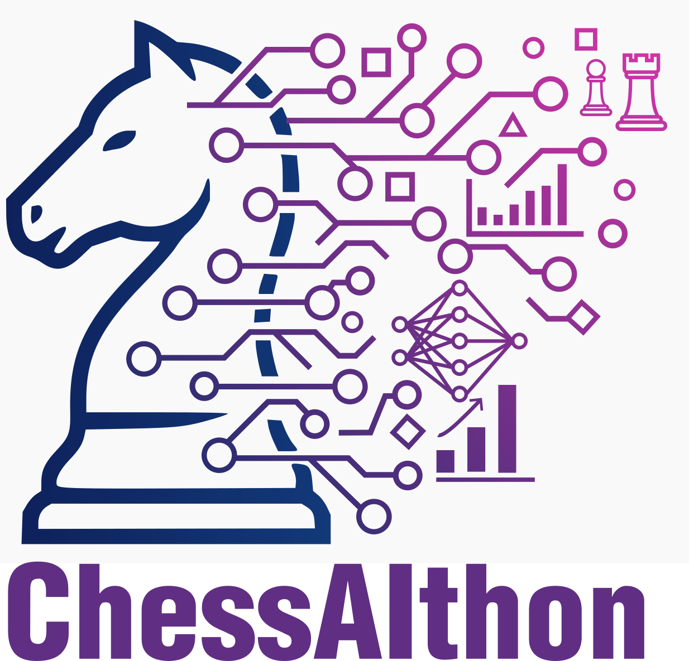

# ChessAIThon

Monorepo for the ChessAIThon (Chess Artificial Intelligence Hackathon) project.

Official Web Page: https://chessaithon.pixel-online.org/
Technical memory: https://xxjcaxx.github.io/ChessAIThon/

This repository contains multiple subprojects (web apps, documentation site, native C libraries and Python tooling) related to building, training and deploying chess AI components used in the ChessAIThon project.

Top-level folders

- `appchesintion/` — Frontend demo built with Vite (small JS app + components).
- `c/` — C/C++ chess-related libraries and bindings.
- `documentacion/` — Documentation site (Docusaurus).
- `libraries/` — Python libraries, helpers and model training scripts.
- `logoschess/` — Branding and logo assets.
- `modelDeploy/` — Model deployment (Gradio app, Docker, examples).

Quick start

1. Inspect the subproject you want to run (see the folders above).
2. Each subfolder contains its own README or package/requirements file with run instructions. Examples:
	- `appchesintion/chessaithonapp` uses Vite (npm scripts: `dev`, `build`, `preview`).
	- `webapp` is an Angular app (npm scripts: `start`, `build`, `test`).
	- `modelDeploy` contains a Gradio app and `requirements.txt` for Python dependencies.

Where to go next

- To run the lightweight demo: see `appchesintion/chessaithonapp/README.md`.
- To deploy or run the model locally: see `modelDeploy/README.md`.
- Check `documentacion/` for technical docs.

en jaquemate falla el servidor
el cliente debe dar las otras opciones