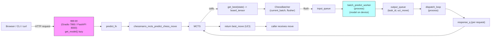

# Architecture diagrams (ASCII + Mermaid)

Below are an ASCII diagram and a Mermaid diagram that show the runtime components and data flow (Gradio/FastAPI → predict_fn → MCTS → ChessBatcher → GPU worker → dispatch → MCTS/client).

## ASCII diagram

```
                                 +-----------------+
                                 |   Browser /     |
                                 |   CLI / curl    |
                                 +--------+--------+
                                          |
                                          | HTTP request (Gradio UI or FastAPI)
                                          v
            +-----------------------------+------------------------------+
            |                           app.py                           |
            |  - Gradio (0.0.0.0:7860)   - FastAPI (0.0.0.0:8000)         |
            |  - get_model() (lazy init)  - predict_fn(fen, sims)         |
            +-----------------------------+------------------------------+
                                          |
                    +---------------------+---------------------+
                    |                                           |
        Gradio calls predict_fn                         FastAPI calls predict_fn
                    |                                           |
                    +---------------------+---------------------+
                                          |
                                          v
                                 +-----------------+
                                 | predict_fn      |
                                 | (calls chesmarro_mcts_predict_chess_move) |
                                 +-----------------+
                                          |
                                          v
                         +------------------------------------+
                         | chessmarro_mcts_predict_chess_move |
                         |  - create root MCTSNode (Board)    |
                         |  - Manager() and ChessBatcher      |
                         +----------------+-------------------+
                                          |
                                          v
                                 +---------------------------+
                                 |           MCTS            |
                                 |  (many worker threads)    |
                                 |  - _select                |
                                 |  - _expand                |
                                 |  - _simulate             <- calls get_best()
                                 |  - _backpropagate        |
                                 +------------+--------------+
                                              |
                                              v
                       get_best(state) -> convert state -> board_tensor
                                              |
                                              v
                                 +---------------------------+
                                 |       ChessBatcher        |
                                 |  - current_batch list     |
                                 |  - add_board(board_tensor, response_q)  |
                                 |  - flusher thread (timer)| 
                                 |  - _flush_batch -> input_queue -> GPU worker
                                 +------------+--------------+
                                              |
                            +-----------------+-----------------+
                            |                                   |
                            v                                   v
                   +-------------------+             +-------------------------+
                   | batch_predict_worker |  <---  input_queue  (Process)    |
                   | (process on host)    |             | Uses model & device  |
                   | - stack tensors      |             +-------------------------+
                   | - model(boards)->preds       |
                   | - preds = [UCI,...]          |
                   +-----------+------------------+
                               |
                               v
                          output_queue (task_id, uci_move)
                               |
                               v
                         +--------------------+
                         |  dispatch_loop     |
                         |  (process)         |
                         |  - pop output_queue|
                         |  - pending[task_id].put(pred) |
                         +--------------------+
                               |
                               v
                       response_q.get()  (MCTS thread blocked until pred)
                               |
                               v
                            MCTS resumes simulation (uses UCI -> chess.Move)
                               |
                               v
                    Simulation ends -> _backpropagate -> continue until all sims
                               |
                               v
                     chessmarro_mcts_predict_chess_move returns best_move (UCI)
                               |
                               v
                         predict_fn returns UCI string to caller
                               |
                               v
                 Gradio UI displays it / FastAPI returns JSON {"move":"e2e4"}
```

## Mermaid diagram

The following Mermaid flowchart describes the same architecture. You can paste it into any Mermaid renderer (e.g., Markdown preview with Mermaid enabled, or mermaid.live).


