# Exploring Chessmaro AI Model

```mermaid
graph TD
    subgraph Input Layer
        A[Input: 77x8x8 Tensor Board State]
    end

    subgraph Feature Extraction CNN Blocks
        direction TB

        %% Block 1: Initial Convolution
        A --> C{Conv1: 77 -> 128 channels}
        C --> D[Batch Norm + ReLU]
        
        %% Block 2: Residual Block (128 -> 256 channels)
        D --> E_MAIN{Conv2: 128 -> 256 Main Path}
        D --> E_SKIP{Res Conv2: 1x1, 128 -> 256 Skip Path}
        E_MAIN --> F[Batch Norm + ReLU]
        E_SKIP --> G(Add Residual)
        F --> G
        G --> H[Output: 256x8x8]

        %% Block 3: Residual Block 256 -> 512 channels
        H --> I_MAIN{Conv3: 256 -> 512 Main Path}
        H --> I_SKIP{Res Conv3: 1x1, 256 -> 512 Skip Path}
        I_MAIN --> J[Batch Norm + ReLU]
        I_SKIP --> K(Add Residual)
        J --> K
        K --> L[Output: 512x8x8]

        %% Block 4: Residual Block 512 -> 1024 channels
        L --> M_MAIN{Conv4: 512 -> 1024 Main Path}
        L --> M_SKIP{Res Conv4: 1x1, 512 -> 1024 Skip Path}
        M_MAIN --> N[Batch Norm + ReLU]
        M_SKIP --> O(Add Residual)
        N --> O
        O --> P[Output: 1024x8x8]
    end

    subgraph Policy Head Fully Connected
        
        P --> Q[Flatten 1024*8*8 = 65536 units]
        
        Q --> R{FC1: Linear 65536 -> 1024}
        R --> S[ReLU + Dropout p=0.4]

        S --> T{FC2: Linear 1024 -> 1024}
        T --> U[ReLU + Dropout p=0.4]

        U --> V{FCF: Linear 1024 -> 4096}
        V --> Z[Policy Output Vector 4096 Moves]
    end
```



# Visualizing results

We have trained a CNN based neural network AI to solve chess situations. But we don't know if it works well or not. We are going to analyze the results by various ways. It will be usefull to understand how this model works.

There are various way to analyze the prerformance:
- Quantitative analysis:
  - Compare with best move in Stockfish or real data
  - Top-k -> Is the best predicted move in the top 5 moves?
- Decision Interpretation
  - Heat maps from the layers to understand how they "see" the board


## Visualizing initial board with legal moves:

> We are using a prepared dataset with 99 best moves by Stockfish.

The first exercise is analizing the algorithm of chess situation and legal moves codification to be undestanded by the CNN.

You can change `n_sample` value to see another example and see if you can detect in the black and white matrix below the meaing of the dots.

The dataset encodes the board into **84 channels**, where:  
- **Channels 0-11** represent **piece positions** (white and black pieces).  
- **Channel 12** represents **which player's turn it is**.  
- **Channels 13-76** represent **legal moves** (directional movement possibilities).  
- **Channels 77-84** are extra placeholders (set to `zeros` here).  

1. Can you identify where the pieces are in the first 12 matrices?  
2. Look at **Channel 12** (Turn Matrix). What value does it have?  
3. Look at **movement matrices** (13-76). What do the white and black dots represent?

Compare the **black and white matrices** to the chessboard (SVG representation) and answer:  
1. Do the **piece matrices (0-11)** match the FEN notation?  
2. Do the **movement matrices** align with how pieces move in chess?  
3. What do you notice in **Knight move matrices** compared to Bishop or Rook movements?  


```python

import matplotlib.pyplot as plt
import matplotlib

df_linchess = pd.read_parquet('/content/drive/MyDrive/linchess_converted_stockfish99.parquet.gzip', engine="pyarrow")
df_linchess['board'] = df_linchess['board'].apply(lambda board: board.reshape(77, 8, 8).astype(int))

n_sample = 95

matriz = df_linchess.loc[n_sample,'board']
fen = df_linchess.loc[n_sample,'fen_original']
print("Fen: ",fen)
print("Turn matrix: ")
print(matriz[12])
print(matriz.shape)

board = chess.Board(df_linchess.loc[n_sample, 'fen_original'])
svg_board = chess.svg.board(board=board, size=300)
display(SVG(svg_board))

labels = ["white pawns", "black pawns", "white knights", "black knights", "white bishops", "black bishops",
         "white rooks", "black rooks", "white queen", "black queen", "white king", "black king", "**Turn**",
         "1 North moves", "1 NE moves", "1 East moves", "1 SE moves", "1 South moves", "1 SW moves", "1 West moves", "1 NW moves",
         "2 North moves", "2 NE moves", "2 East moves", "2 SE moves", "2 South moves", "2 SW moves", "2 West moves", "2 NW moves",
         "3 North moves", "3 NE moves", "3 East moves", "3 SE moves", "3 South moves", "3 SW moves", "3 West moves", "3 NW moves",
         "4 North moves", "4 NE moves", "4 East moves", "4 SE moves", "4 South moves", "4 SW moves", "4 West moves", "4 NW moves",
         "5 North moves", "5 NE moves", "5 East moves", "5 SE moves", "5 South moves", "5 SW moves", "5 West moves", "5 NW moves",
         "6 North moves", "6 NE moves", "6 East moves", "6 SE moves", "6 South moves", "6 SW moves", "6 West moves", "6 NW moves",
         "7 North moves", "7 NE moves", "7 East moves", "7 SE moves", "7 South moves", "7 SW moves", "7 West moves", "7 NW moves",
         "E2N Knight", "2EN Knight", "2ES Knight", "E2S Knight", "W2S Knight", "2WS Knight", "2WN Knight", "W2N Knight",
         "none", "none", "none", "none", "none", "none", "none", "none",
         "none", "none", "none", "none", "none", "none", "none", "none",
         ]

filas = 7
columnas = 12
fig, axs = plt.subplots(filas, columnas, figsize=(10, 10))
plt.subplots_adjust(wspace=0.2, hspace=0.2)
for i in range(84):
    fila = i // columnas
    columna = i % columnas
    canal = matriz[i] if i < 77 else np.zeros((8, 8))
    axs[fila, columna].imshow(canal, cmap='gray', vmin=0, vmax=1)
    axs[fila, columna].axis('off')  # Desactiva los ejes para una mejor visualización
    axs[fila, columna].text(4, 9, labels[i], fontsize=6, ha='center', va='top')
plt.show()
```

    Fen:  r3k2r/1bqp1pp1/p1nbpn1p/8/Pp2PP2/1B1QB2N/1PPN2PP/R3K2R b KQkq - 0 13
    Turn matrix: 
    [[0 0 0 0 0 0 0 0]
     [0 0 0 0 0 0 0 0]
     [0 0 0 0 0 0 0 0]
     [0 0 0 0 0 0 0 0]
     [0 0 0 0 0 0 0 0]
     [0 0 0 0 0 0 0 0]
     [0 0 0 0 0 0 0 0]
     [0 0 0 0 0 0 0 0]]
    (77, 8, 8)


    

    


    

    


## Quantitative analysis

We have a **chess AI** that predicts the best move to play in a given position. However, we also have **Stockfish**, one of the strongest chess engines, which gives us a list of the **best possible moves**.  

This graph helps us understand:  
1. **How often the AI's predicted move matches Stockfish’s best moves.**  
2. **If the AI’s move is completely different from what Stockfish suggests.**  
3. **Whether the AI’s move matches what human players typically play.**  


Understanding the graph:
1. If most bars are high for **Rank 1**, the AI is picking very strong moves, just like Stockfish. ✅  
2. If the AI's moves often rank **2nd, 3rd, 4th, or 5th**, it means the AI is good but not always perfect. 🤔  
3. If many moves fall **outside Stockfish’s top choices**, the AI might be weak or playing a different style. ❌  
4. If the AI’s choices match **human best moves** (green line), it might be playing in a more human-like way rather than trying to be as perfect as Stockfish. 🧠  


```python
df_linchess
```

<table border="1" class="dataframe">
  <thead>
    <tr >
      <th></th>
      <th>board</th>
      <th>best</th>
      <th>fen_original</th>
      <th>best_uci</th>
      <th>sf_best</th>
    </tr>
  </thead>
  <tbody>
    <tr>
      <th>0</th>
      <td>[[[0, 0, 0, 0, 0, 0, 0, 0], [0, 0, 0, 0, 0, 1,...</td>
      <td>140</td>
      <td>4rbk1/1pp1qPpn/p1n4p/3r4/P7/5N1P/1P2QPP1/R1B1R...</td>
      <td>e7f7</td>
      <td>[g8f7, e7f7, g8h8]</td>
    </tr>
    <tr>
      <th>1</th>
      <td>[[[0, 0, 0, 0, 0, 0, 0, 0], [0, 0, 0, 0, 0, 0,...</td>
      <td>4077</td>
      <td>r2qkbnr/1pp1pppp/p1b5/3p4/3P4/4PN2/PPP2PPP/RNB...</td>
      <td>f3e5</td>
      <td>[f3e5, b2b3, e1g1, d1e2, a2a4]</td>
    </tr>
    <tr>
      <th>2</th>
      <td>[[[0, 0, 0, 0, 0, 0, 0, 0], [0, 0, 0, 0, 0, 0,...</td>
      <td>776</td>
      <td>rn1qkbnr/ppp2ppp/3p4/4p3/4P3/1PN5/1PPP1PPP/R1B...</td>
      <td>a7a5</td>
      <td>[g8f6, b8d7, c7c6, f8e7, b8c6]</td>
    </tr>
    <tr>
      <th>3</th>
      <td>[[[0, 0, 0, 0, 0, 0, 0, 0], [0, 0, 0, 0, 0, 0,...</td>
      <td>20</td>
      <td>r7/1p2q2p/p1n1Qbk1/5p2/5B1P/PN6/1P4P1/R6K w - ...</td>
      <td>e6e7</td>
      <td>[h4h5, e6e7, b3c5, a1e1, e6d5]</td>
    </tr>
    <tr>
      <th>4</th>
      <td>[[[0, 0, 0, 0, 0, 0, 0, 0], [0, 0, 0, 0, 0, 0,...</td>
      <td>331</td>
      <td>r3k2r/1p1bnp1p/p3p1p1/3q4/3P4/8/PP3PPP/RNBQR1K...</td>
      <td>d7c6</td>
      <td>[d7c6, e7f5, d5h5, d5d6, d5a5]</td>
    </tr>
    <tr>
      <th>...</th>
      <td>...</td>
      <td>...</td>
      <td>...</td>
      <td>...</td>
      <td>...</td>
    </tr>
    <tr>
      <th>95</th>
      <td>[[[0, 0, 0, 0, 0, 0, 0, 0], [0, 0, 0, 0, 0, 0,...</td>
      <td>272</td>
      <td>r3k2r/1bqp1pp1/p1nbpn1p/8/Pp2PP2/1B1QB2N/1PPN2...</td>
      <td>a6a5</td>
      <td>[d6e7, d6f8, c6a5, e8g8, a8c8]</td>
    </tr>
    <tr>
      <th>96</th>
      <td>[[[0, 0, 0, 0, 0, 0, 0, 0], [0, 0, 0, 0, 0, 0,...</td>
      <td>3682</td>
      <td>3Q4/7p/8/7k/2N2pr1/1B6/1PP2K2/8 w - - 3 55</td>
      <td>c4e5</td>
      <td>[d8e7, c4e5, d8f6, d8d7, c2c3]</td>
    </tr>
    <tr>
      <th>97</th>
      <td>[[[0, 0, 0, 0, 0, 0, 0, 0], [0, 0, 0, 0, 0, 0,...</td>
      <td>778</td>
      <td>rnbqkbnr/pppppppp/8/8/4P3/8/PPPP1PPP/RNBQKBNR ...</td>
      <td>c7c5</td>
      <td>[c7c5, e7e5, c7c6, e7e6, b8c6]</td>
    </tr>
    <tr>
      <th>98</th>
      <td>[[[0, 0, 0, 0, 0, 0, 0, 0], [0, 0, 0, 0, 0, 0,...</td>
      <td>957</td>
      <td>r2r2k1/2pB1ppp/p1Pb4/1p6/6Q1/qP2B2P/P1R2PP1/5R...</td>
      <td>f1d1</td>
      <td>[f1d1, e3c1, c2d2, c2e2, g2g3]</td>
    </tr>
    <tr>
      <th>99</th>
      <td>[[[0, 0, 0, 0, 0, 0, 0, 0], [0, 0, 0, 0, 0, 0,...</td>
      <td>55</td>
      <td>5rn1/pp4k1/2p1p3/5n1R/3PN3/2P5/PP4PP/5RK1 w - ...</td>
      <td>h2h3</td>
      <td>[e4c5, e4g5, h5g5, f1f4, f1f3]</td>
    </tr>
  </tbody>
</table>
<p>100 rows × 5 columns</p>

 

```python
df_linchess['predicted_best_move'] = None

# Iterate through the rows and predict best move for each chess position
for index, row in df_linchess.iterrows():
    try:
        board = row['board']
        predicted_move = get_best(board)
        df_linchess.loc[index, 'predicted_best_move'] = number_to_uci(predicted_move['outputs'].argmax(dim=1, keepdim=True).item())
    except Exception as e:
        print(f"Error processing row {index}: {e}")
        df_linchess.loc[index, 'predicted_best_move'] = "Error" # Or handle the error as you see fit

#Example of how to use the new column
df_linchess[['fen_original', 'predicted_best_move','sf_best']]

```

<table border="1" class="dataframe">
  <thead>
    <tr >
      <th></th>
      <th>fen_original</th>
      <th>predicted_best_move</th>
      <th>sf_best</th>
    </tr>
  </thead>
  <tbody>
    <tr>
      <th>0</th>
      <td>4rbk1/1pp1qPpn/p1n4p/3r4/P7/5N1P/1P2QPP1/R1B1R...</td>
      <td>g8h8</td>
      <td>[g8f7, e7f7, g8h8]</td>
    </tr>
    <tr>
      <th>1</th>
      <td>r2qkbnr/1pp1pppp/p1b5/3p4/3P4/4PN2/PPP2PPP/RNB...</td>
      <td>f3e5</td>
      <td>[f3e5, b2b3, e1g1, d1e2, a2a4]</td>
    </tr>
    <tr>
      <th>2</th>
      <td>rn1qkbnr/ppp2ppp/3p4/4p3/4P3/1PN5/1PPP1PPP/R1B...</td>
      <td>g8f6</td>
      <td>[g8f6, b8d7, c7c6, f8e7, b8c6]</td>
    </tr>
    <tr>
      <th>3</th>
      <td>r7/1p2q2p/p1n1Qbk1/5p2/5B1P/PN6/1P4P1/R6K w - ...</td>
      <td>e6e7</td>
      <td>[h4h5, e6e7, b3c5, a1e1, e6d5]</td>
    </tr>
    <tr>
      <th>4</th>
      <td>r3k2r/1p1bnp1p/p3p1p1/3q4/3P4/8/PP3PPP/RNBQR1K...</td>
      <td>e8g8</td>
      <td>[d7c6, e7f5, d5h5, d5d6, d5a5]</td>
    </tr>
    <tr>
      <th>...</th>
      <td>...</td>
      <td>...</td>
      <td>...</td>
    </tr>
    <tr>
      <th>95</th>
      <td>r3k2r/1bqp1pp1/p1nbpn1p/8/Pp2PP2/1B1QB2N/1PPN2...</td>
      <td>e8g8</td>
      <td>[d6e7, d6f8, c6a5, e8g8, a8c8]</td>
    </tr>
    <tr>
      <th>96</th>
      <td>3Q4/7p/8/7k/2N2pr1/1B6/1PP2K2/8 w - - 3 55</td>
      <td>d8d4</td>
      <td>[d8e7, c4e5, d8f6, d8d7, c2c3]</td>
    </tr>
    <tr>
      <th>97</th>
      <td>rnbqkbnr/pppppppp/8/8/4P3/8/PPPP1PPP/RNBQKBNR ...</td>
      <td>b7b6</td>
      <td>[c7c5, e7e5, c7c6, e7e6, b8c6]</td>
    </tr>
    <tr>
      <th>98</th>
      <td>r2r2k1/2pB1ppp/p1Pb4/1p6/6Q1/qP2B2P/P1R2PP1/5R...</td>
      <td>f1c1</td>
      <td>[f1d1, e3c1, c2d2, c2e2, g2g3]</td>
    </tr>
    <tr>
      <th>99</th>
      <td>5rn1/pp4k1/2p1p3/5n1R/3PN3/2P5/PP4PP/5RK1 w - ...</td>
      <td>h5g5</td>
      <td>[e4c5, e4g5, h5g5, f1f4, f1f3]</td>
    </tr>
  </tbody>
</table>
<p>100 rows × 3 columns</p>


```python
import matplotlib.pyplot as plt
import numpy as np
import seaborn as sns
import chess
import chess.svg
from IPython.display import SVG

def plot_move_rank_distribution(rank_counts, not_in_sf_best, in_human_best, in_human_and_sf_best, total_fail, total_sf_best):
    ranks = list(rank_counts.keys())
    counts = list(rank_counts.values())

    plt.figure(figsize=(10, 6))
    bars = plt.bar(ranks, counts, color='royalblue', label='Predicted Move Rank in sf_best')

    # Add data labels on bars
    for bar in bars:
        yval = bar.get_height()
        plt.text(bar.get_x() + bar.get_width()/2, yval + 5, str(int(yval)), ha='center', fontsize=10)

    # Stacked bars for Human Best & Human + SF Best
    plt.bar(max(ranks) + 1, in_human_best, color='green', label='In Human Best')
    plt.bar(max(ranks) + 1, total_sf_best - in_human_best, bottom=in_human_best, color='purple', label='total sf')
    plt.bar(max(ranks) + 1, in_human_and_sf_best - total_sf_best , bottom=total_sf_best, color='orange', label='Human +sf')


    plt.bar(max(ranks) + 2, not_in_sf_best, color='red', label='Not in sf_best')
    plt.bar(max(ranks) + 2, total_fail, color='black', label='Total Fail')

    plt.xlabel('Rank in Stockfish Best Moves')
    plt.ylabel('Number of Predictions')
    plt.title('Distribution of AI-Predicted Moves Compared to Stockfish')
    plt.xticks(ranks + [max(ranks) + 1, max(ranks) + 2], labels=ranks + ['Human and SF', '!FS, total fail'])
    plt.legend()
    plt.show()


# Create a dictionary to store the counts of predicted moves in each position
rank_counts = {}
for i in range(1, 6):  # Assuming a maximum of 99 positions
    rank_counts[i] = 0

not_in_sf_best = 0
in_human_best = 0
in_human_and_sf_best = 0
total_fail = 0

for index, row in df_linchess.iterrows():
    predicted_move = row['predicted_best_move']
    sf_best_moves = row['sf_best']
    human_best_move = row['best']

    if predicted_move != "Error":
      try:
        # Convert the NumPy array to a list to use the index() method
        rank = sf_best_moves.tolist().index(predicted_move) + 1
        if rank in rank_counts:
          rank_counts[rank] += 1
        else:
          print("Move not found in sf_best at a valid position!")
      except ValueError:
          not_in_sf_best += 1
    else:
      not_in_sf_best += 1
    if predicted_move == number_to_uci(human_best_move):
      in_human_best += 1
    if predicted_move == number_to_uci(human_best_move) or predicted_move in sf_best_moves:
      in_human_and_sf_best += 1
    if predicted_move != number_to_uci(human_best_move) and not predicted_move in sf_best_moves:
      total_fail += 1

#rank_counts[6] = not_in_sf_best
#rank_counts[7] = in_human_best

total_sf_best = sum(rank_counts.values())
#print(f"Total positions in sf_best: {total_sf_best}")
print(total_sf_best,in_human_best,in_human_and_sf_best)

# Plotting
ranks = list(rank_counts.keys())
counts = list(rank_counts.values())


plot_move_rank_distribution(rank_counts, not_in_sf_best, in_human_best, in_human_and_sf_best, total_fail, total_sf_best)

```

    59 31 60


    

    


The heatmap of mistakes visually represents where the AI makes the most errors on the chessboard. Each square's color intensity corresponds to the number of times the AI chose a move starting from that square that did not match Stockfish's best moves. Darker or more intense red squares indicate positions where the AI frequently makes mistakes, while lighter or blank squares suggest areas with fewer errors. This helps identify patterns in the AI’s decision-making, such as whether it struggles more in the opening, middlegame, or specific piece movements. By analyzing this heatmap, we can better understand the model's weaknesses and areas for improvement.


```python
# Heatmap Visualization
def plot_heatmap_from_mistakes(df_linchess):
    """
    Extracts mistakes from DataFrame and plots a heatmap.
    """
    mistake_counts = {}

    for index, row in df_linchess.iterrows():
        predicted_move = row['predicted_best_move']
        sf_best_moves = row['sf_best']

        if predicted_move != "Error" and predicted_move not in sf_best_moves:
            try:
                start_square = chess.parse_square(predicted_move[:2])  # Extract start square
                if start_square in mistake_counts:
                    mistake_counts[start_square] += 1
                else:
                    mistake_counts[start_square] = 1
            except:
                pass  # Handle invalid move formats

    board_array = np.zeros((8, 8))  # Initialize 8x8 board representation

    # Fill in mistake data
    for square, count in mistake_counts.items():
        row, col = divmod(square, 8)  # Convert chess square index to row/col
        board_array[7 - row, col] = count  # Flip row for correct board orientation

    plt.figure(figsize=(8, 8))
    sns.heatmap(board_array, annot=True, fmt='g', cmap='Reds', linewidths=0.5, square=True, cbar=True)
    plt.title("AI Move Mistakes Heatmap")
    plt.xlabel("File (a-h)")
    plt.ylabel("Rank (1-8)")
    plt.xticks(ticks=np.arange(8) + 0.5, labels=list("abcdefgh"))
    plt.yticks(ticks=np.arange(8) + 0.5, labels=list("87654321"))
    plt.show()


plot_heatmap_from_mistakes(df_linchess)

```


    

    


This 100 examples by stockfish is insufficient to make a good mistake heat map, we will use a bigger dataset with human best:


```python
def read_data(file,page,size):
    with pq.ParquetFile(file) as pf:
        print("reading",file, page, size, pf.metadata)

        iterb = pf.iter_batches(batch_size = size)
        for i in range(page):
            next(iterb)

        batches = next(iterb)

        # Construir el DataFrame
        df_chess = pa.Table.from_batches([batches]).to_pandas()

        batches = None
        iterb = None

        # reshape
        df_chess['board'] = df_chess['board'].apply(lambda board: board.reshape(77, 8, 8).astype(int))
        df_chess['predicted_best_move'] = df_chess['board'].apply(lambda board: number_to_uci(get_best(board)['outputs'].argmax(dim=1, keepdim=True).item()))
        df_chess.info(memory_usage='deep')
        df_chess.memory_usage(deep=True)
        return df_chess

df_chess = read_data('/content/drive/MyDrive/linchesgamesconverted0.parquet.gz',0,20000)
```
```
    reading /content/drive/MyDrive/linchesgamesconverted0.parquet.gz 0 20000 <pyarrow._parquet.FileMetaData object at 0x7e2555174310>
      created_by: parquet-cpp-arrow version 14.0.2
      num_columns: 4
      num_rows: 2000000
      num_row_groups: 2
      format_version: 2.6
      serialized_size: 3526
    <class 'pandas.core.frame.DataFrame'>
    RangeIndex: 20000 entries, 0 to 19999
    Data columns (total 5 columns):
     #   Column               Non-Null Count  Dtype 
    ---  ------               --------------  ----- 
     0   board                20000 non-null  object
     1   best                 20000 non-null  int64 
     2   fen_original         20000 non-null  object
     3   best_uci             20000 non-null  object
     4   predicted_best_move  20000 non-null  object
    dtypes: int64(1), object(4)
    memory usage: 759.5 MB
```


```python

def plot_heatmap_from_mistakes_human(df_linchess):
    """
    Extracts mistakes from DataFrame and plots a heatmap.
    """
    mistake_counts = {}

    for index, row in df_linchess.iterrows():
        predicted_move = row['predicted_best_move']
        best_moves = number_to_uci(row['best'])

        if predicted_move != "Error" and predicted_move != best_moves:
            try:
                start_square = chess.parse_square(predicted_move[:2])  # Extract start square
                if start_square in mistake_counts:
                    mistake_counts[start_square] += 1
                else:
                    mistake_counts[start_square] = 1
            except:
                pass  # Handle invalid move formats

    board_array = np.zeros((8, 8))  # Initialize 8x8 board representation

    # Fill in mistake data
    for square, count in mistake_counts.items():
        row, col = divmod(square, 8)  # Convert chess square index to row/col
        board_array[7 - row, col] = count  # Flip row for correct board orientation

    plt.figure(figsize=(8, 8))
    sns.heatmap(board_array, annot=True, fmt='g', cmap='Reds', linewidths=0.5, square=True, cbar=True)
    plt.title("AI Move Mistakes Heatmap")
    plt.xlabel("File (a-h)")
    plt.ylabel("Rank (1-8)")
    plt.xticks(ticks=np.arange(8) + 0.5, labels=list("abcdefgh"))
    plt.yticks(ticks=np.arange(8) + 0.5, labels=list("87654321"))
    plt.show()


plot_heatmap_from_mistakes_human(df_chess)


```


    

    


## Visualizing pieces heat map

The code provided in the next cells provides an **interactive way** to understand how **Convolutional Neural Networks (CNNs)** can evaluate and predict chess moves. It allows to **see the decision-making process** of a chess-playing AI, bridging the gap between **deep learning** and **game strategy**.


- The neural network used here **does not see a chessboard as humans do**.  
- Instead, it processes **matrices (images)** that represent **pieces, turns, and possible moves**.  
- Each channel in the `matriz` represents a **different feature**, such as:  
  - Which pieces are on the board (12 channels for each piece type).  
  - Whether it’s **White’s or Black’s turn** (1 channel).  
  - The **possible legal moves** (many channels).  

  By visualizing **these matrices as heat maps**, we can understand **where the CNN is focusing**.
- A **heat map** is a **visual representation of how much the CNN values a move**.  
- The **brighter areas** show squares the CNN thinks are **strong candidates** for the next move.  
- This helps us see **what the AI considers important** in a chess position.  

You can compare:
1. The **raw CNN output** (`example_best`).
2. The **filtered legal move CNN output** (`example_best_legal`).
3. The **Stockfish move** (classical chess engine).

You can analyze:
- Does the CNN **understand legal moves**, or does it suggest **illegal** ones?  
- How does the CNN’s move choice **compare to Stockfish**, a traditional chess engine?  
- When do the **best predicted moves** match Stockfish’s **optimal** move?

You can detect if the CNN doesn't works well:
- If `"No coincidence!"` appears often, it means the **CNN predicts illegal moves** too frequently.  
- If the CNN often **disagrees with Stockfish**, it may not be **strong enough** to play at a high level.  
- The heat map shows **whether the CNN understands piece activity correctly**.


```python
def visualize_heat_maps(sample_n):

    sample_list = df_linchess.sample(n=sample_n).index

    for sample_idx, sample in enumerate(sample_list):
        matriz = df_linchess.loc[sample, 'board']
        board = chess.Board(df_linchess.loc[sample, 'fen_original'])

        example_best = get_best(matriz,mask=False)  # Without legal moves mask to show all results in heat map
        example_best_legal = get_best(matriz,mask=True)  # With mask to extract real legal move

        print("NN Best",number_to_uci(example_best['outputs'].argmax(dim=1, keepdim=True).item()),
              "NN Best Legal",number_to_uci(example_best_legal['outputs'].argmax(dim=1, keepdim=True).item()),
              "Stockfish Best",  df_linchess.loc[sample,'sf_best']
             )
        imagen_final = np.zeros((8,8))
        for idx,i in  enumerate(example_best['outputs'].cpu().detach().numpy()[0]):
            if(abs(i) > 0.2):
                (code, x, y) = np.unravel_index(idx, (64, 8, 8))
                imagen_final[x,y] = imagen_final[x,y] if imagen_final[x,y] > i else i

        imagen_final_normalized = (imagen_final - imagen_final.min()) / (imagen_final.max() - imagen_final.min())

        cmap = matplotlib.colormaps['viridis']
        fill = {}
        for i in range(8):
            for j in range(8):
                fill[(7-i)*8 + j] = '#%02x%02x%02x%02x' % tuple([round(255*x) for x in cmap(imagen_final_normalized[i,j])])

        final_position_best = chess.Move.from_uci(number_to_uci(example_best['outputs'].argmax(dim=1, keepdim=True).item()))
        final_position_best_legal = chess.Move.from_uci(number_to_uci(example_best_legal['outputs'].argmax(dim=1, keepdim=True).item()))
        final_position_best_sf = chess.Move.from_uci(df_linchess.loc[sample,'sf_best'][0])

        arrows=[
            chess.svg.Arrow(final_position_best.from_square, final_position_best.to_square, color="#ffcccc"),
            chess.svg.Arrow(final_position_best_legal.from_square, final_position_best_legal.to_square, color="#ff5555"),
            chess.svg.Arrow(final_position_best_sf.from_square, final_position_best_sf.to_square, color="#ccffcc")
        ]

        if final_position_best.to_square != final_position_best_legal.to_square:
            print("No coincidence!")

        svg_board = chess.svg.board(board=board, fill=fill, arrows=arrows, size=300)
        display(SVG(svg_board))

visualize_heat_maps(10)
```

    NN Best f3d4 NN Best Legal f3d4 Stockfish Best ['f3d4' 'c4c5' 'c4b5' 'b3a2' 'b3d1']


    

    


    NN Best h6f7 NN Best Legal h6f7 Stockfish Best ['b8c7' 'h6g4' 'a6a5' 'h8h7' 'b8a7']


    

    


    NN Best f7d5 NN Best Legal f7d5 Stockfish Best ['f7b3' 'f7d5' 'f7c4' 'f7h5' 'a2a3']


    

    


    NN Best f2f3 NN Best Legal f2f3 Stockfish Best ['f2f3' 'f2f1' 'f2e1' 'f2g1']


    

    


    NN Best e8c8 NN Best Legal e8c8 Stockfish Best ['c6d4' 'f8f7' 'd7g4' 'h7h6' 'a8c8']


    

    


    NN Best d2d3 NN Best Legal d2d3 Stockfish Best ['g1e2' 'd2d3' 'c2c3' 'b1c3' 'c4b3']


    

    


    NN Best e2e3 NN Best Legal e2e3 Stockfish Best ['c4f7' 'e2e1' 'e2e4' 'e2f3' 'e2e3']


    

    


    NN Best d2d4 NN Best Legal d2d4 Stockfish Best ['d2d4' 'e3e4' 'h2h4' 'f1c4' 'a2a4']


    

    


    NN Best c3b4 NN Best Legal c3b4 Stockfish Best ['g3g4' 'c3d3' 'h3h5' 'f2g2' 'f2g1']


    

    


    NN Best f3f4 NN Best Legal f3f4 Stockfish Best ['d3a3' 'd3c3' 'd3d5' 'f3e3' 'd3b3']


    

    


## Visualising NN best moves heat map

This code is an **advanced visualization tool** that helps us **analyze how a Convolutional Neural Network (CNN) processes chess positions**. It allows us to **see inside the neural network** and understand how it extracts information at different layers.  

- Each convolutional layer captures **different levels of abstraction**:  
  1. **Early layers (`conv1`)** → Detect **edges, shapes, and textures**.  
  2. **Mid layers (`conv2` and `conv3`)** → Recognize **piece positions and movement patterns**.  
  3. **Deeper layers (`conv4`)** → Identify **strategic factors like threats and control over squares**.  
- By visualizing these layers, we see **how the CNN gradually builds its understanding** of a chess position.

- The heat maps show **where the CNN is focusing** when analyzing the chessboard.  
- Brighter areas in the heat maps **indicate important regions** for the AI’s decision-making.  
- This can help us **interpret why the AI chooses certain moves**.  
- Unlike humans, CNNs don’t know **explicit chess rules**.  
- Instead, they **learn patterns** from data, recognizing important squares and piece activity.  
- The heat maps **reveal what the model considers important** in a given position.  
- **Move Predictions Can Be Explained** → If the CNN picks a bad move, heat maps help diagnose **why it made that mistake**.  
- **Helps Debug and Improve the Model** → If heat maps don’t match human intuition, the model may need **better training data**.  

You can play with this code:
1. **Compare heat maps for different positions.** Does the AI focus more on **attacks**, **defense**, or **central control**?  
2. **Modify the CNN architecture.** Does adding more layers improve the move predictions?  
3. **Test different chess positions.** How do heat maps change in **endgames vs. middlegames**?  


```python
# https://kozodoi.me/blog/20210527/extracting-features
import matplotlib.pyplot as plt
import matplotlib
sample = 4  # 3 are interesting
features = {}

def get_features(name):
    def hook(model, input, output):
        features[name] = output.detach()

    return hook

model.conv1.register_forward_hook(get_features("feats1"))
model.conv2.register_forward_hook(get_features("feats2"))
model.conv3.register_forward_hook(get_features("feats3"))
model.conv4.register_forward_hook(get_features("feats4"))

matriz =  df_linchess.loc[sample,'board']
board = chess.Board(df_linchess.loc[sample,'fen_original'])

example_best_legal = get_best(matriz,mask=True)  # With mask to extract real legal move
best = number_to_uci(example_best_legal['outputs'].argmax(dim=1, keepdim=True).item())

print("NN Best",best, "Stockfish Best",  df_linchess.loc[sample,'sf_best'])
svg_board = chess.svg.board(board=board, size=300)
display(SVG(svg_board))
#features['feats'].shape
print(features['feats1'].shape)
print(features['feats2'].shape)
print(features['feats3'].shape)
print(features['feats4'].shape)

matriz1 = np.sum(features['feats1'][0].cpu().numpy(),axis=0)
matriz2 = np.sum(features['feats2'][0].cpu().numpy(),axis=0)
matriz3 = np.sum(features['feats3'][0].cpu().numpy(),axis=0)
matriz4 = np.sum(features['feats4'][0].cpu().numpy(),axis=0)
print(matriz1.shape)


files = ['a', 'b', 'c', 'd', 'e', 'f', 'g', 'h']
ranks = ['1', '2', '3', '4', '5', '6', '7', '8']

def plot_heatmap(matriz, title):
    plt.figure(figsize=(3.5, 3.5))
    plt.imshow(matriz, cmap='inferno', origin='upper')  # 'upper' so rank 1 is at the bottom
    #plt.colorbar()

    # Set axis labels
    plt.xticks(ticks=np.arange(8), labels=files, fontsize=12)  # a-h
    plt.yticks(ticks=np.arange(8), labels=reversed(ranks), fontsize=12)  # 1-8 (reversed)

    plt.title(title, fontsize=14)
    plt.show()

# Plot all heatmaps with chessboard labels
plot_heatmap(matriz1, "Feature Map - Conv1")
plot_heatmap(matriz2, "Feature Map - Conv2")
plot_heatmap(matriz3, "Feature Map - Conv3")
plot_heatmap(matriz4, "Feature Map - Conv4")
```

    NN Best e8g8 Stockfish Best ['d7c6' 'e7f5' 'd5h5' 'd5d6' 'd5a5']


    

    


    torch.Size([1, 128, 8, 8])
    torch.Size([1, 256, 8, 8])
    torch.Size([1, 512, 8, 8])
    torch.Size([1, 1024, 8, 8])
    (8, 8)


    

    


    

    


    

    


    

    


```python
import matplotlib.pyplot as plt
import numpy as np
import chess
import chess.svg
from IPython.display import display, SVG

sample = 4
features = {}

def get_features(name):
    """Hook function to extract features from each layer of the CNN"""
    def hook(model, input, output):
        features[name] = output.detach()
    return hook

# Register hooks to each layer
model.conv1.register_forward_hook(get_features("feats1"))
model.conv2.register_forward_hook(get_features("feats2"))
model.conv3.register_forward_hook(get_features("feats3"))
model.conv4.register_forward_hook(get_features("feats4"))
model.fc1.register_forward_hook(get_features("fc1"))
model.fc2.register_forward_hook(get_features("fc2"))

# Get the board and the neural network prediction
matriz = df_linchess.loc[sample, 'board']
board = chess.Board(df_linchess.loc[sample, 'fen_original'])

example_best_legal = get_best(matriz, mask=True)  # With mask to extract real legal move
best_move = number_to_uci(example_best_legal['outputs'].argmax(dim=1, keepdim=True).item())

svg_board = chess.svg.board(board=board, size=300)
display(SVG(svg_board))

print("NN Best Move:", best_move)

# Get feature maps from the CNN layers
matriz1 = features['feats1'][0].cpu().numpy()  # First convolutional layer feature map
matriz2 = features['feats2'][0].cpu().numpy()  # Second convolutional layer feature map
matriz3 = features['feats3'][0].cpu().numpy()  # Third convolutional layer feature map
matriz4 = features['feats4'][0].cpu().numpy()  # Fourth convolutional layer feature map
fc1_activations = features['fc1'].cpu().numpy()
fc2_activations = features['fc2'].cpu().numpy()

# Function to reduce 3D feature map (channels x height x width) to 2D by averaging across channels
def reduce_feature_map(feature_map):
    return np.mean(feature_map, axis=0)

# Reduce feature maps to 2D (average over channels)
matriz1_reduced = reduce_feature_map(matriz1)
matriz2_reduced = reduce_feature_map(matriz2)
matriz3_reduced = reduce_feature_map(matriz3)
matriz4_reduced = reduce_feature_map(matriz4)


# Chessboard coordinates (files and ranks for axis labeling)
files = ['a', 'b', 'c', 'd', 'e', 'f', 'g', 'h']
ranks = ['1', '2', '3', '4', '5', '6', '7', '8']

# Function to plot the feature map with inverted colormap for better visualization of important activations
def plot_feature_map_with_top_k_inverted(feature_map, title, k=5, cmap='viridis'):
    """Plot the feature map and highlight the top activations with inverted colormap."""
    plt.figure(figsize=(3, 3))

    # Normalize the feature map
    feature_map_normalized = (feature_map - np.min(feature_map)) / (np.max(feature_map) - np.min(feature_map))

    # Invert the feature map for clearer visual representation (important areas become warm colors)
    feature_map_normalized = 1 - feature_map_normalized  # Invert the colors

    # Identify the top-k coordinates (highest activations) after normalization and inversion
    top_k_coords = np.unravel_index(np.argsort(feature_map_normalized.flatten())[-k:], feature_map_normalized.shape)

    # Plot the heatmap with inverted colormap
    plt.imshow(feature_map_normalized, cmap=cmap, origin='upper', vmin=0, vmax=1)

    # Set axis labels
    plt.xticks(ticks=np.arange(8), labels=files, fontsize=12)
    plt.yticks(ticks=np.arange(8), labels=reversed(ranks), fontsize=12)

    # Highlight top-k activations with circles
    for i in range(len(top_k_coords[0])):
        plt.scatter(top_k_coords[1][i], top_k_coords[0][i], s=150, edgecolor='red', facecolor='none', lw=2)

    plt.show()

# Plot feature maps with top-k activations after normalization and inversion
plot_feature_map_with_top_k_inverted(matriz1_reduced, "Feature Map - Conv1", k=5)
plot_feature_map_with_top_k_inverted(matriz2_reduced, "Feature Map - Conv2", k=5)
plot_feature_map_with_top_k_inverted(matriz3_reduced, "Feature Map - Conv3", k=5)
plot_feature_map_with_top_k_inverted(matriz4_reduced, "Feature Map - Conv4", k=5)


output_predictions = example_best_legal['outputs'][0].cpu().detach().numpy()
# Get top-k moves (highest predicted moves)
k=5
top_k = output_predictions.argsort()[-k:][::-1]

# Print the top-k moves and their corresponding probabilities/scores
for idx in top_k:
    move = number_to_uci(idx)
    score = output_predictions[idx]
    print(f"Number: {idx} Move: {move}, Score: {score}")
```


    

    


    NN Best Move: e8g8


    

    


    

    


    

    


    

    


    Number: 644 Move: e8g8, Score: 18.2082576751709
    Number: 3788 Move: e7f5, Score: 16.302738189697266
    Number: 3916 Move: e7c6, Score: 15.7904691696167
    Number: 777 Move: b7b5, Score: 15.535648345947266
    Number: 640 Move: a8c8, Score: 15.155900001525879

