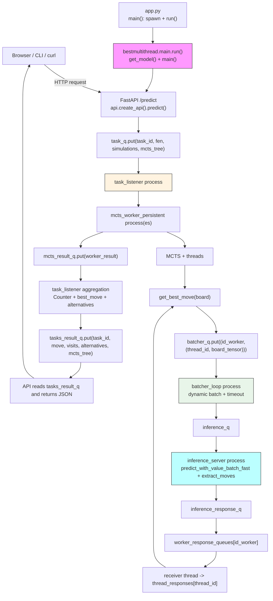

# Architecture diagrams (ASCII + Mermaid)

## Mermaid diagram

The following Mermaid flowchart describes the same architecture. 

```mermaid
flowchart TD
  A[Browser / CLI / curl]
  B["app.py<br/>main(): spawn + run()"]
  C["bestmultithread.main.run()<br/>get_model() + main()"]
  D["FastAPI /predict<br/>api.create_api().predict()"]

  E["task_q.put(task_id, fen, simulations, mcts_tree)"]
  F["task_listener process"]
  G["mcts_worker_persistent process(es)"]
  H["MCTS + threads"]
  I["get_best_move(board)"]
  J["batcher_q.put((id_worker,(thread_id, board_tensor)))"]

  K["batcher_loop process<br/>dynamic batch + timeout"]
  L["inference_q"]
  M["inference_server process<br/>predict_with_value_batch_fast + extract_moves"]
  N["inference_response_q"]
  O["worker_response_queues[id_worker]"]
  P["receiver thread -> thread_responses[thread_id]"]

  Q["mcts_result_q.put(worker_result)"]
  R["task_listener aggregation<br/>Counter + best_move + alternatives"]
  S["tasks_result_q.put(task_id, move, visits, alternatives, mcts_tree)"]
  T["API reads tasks_result_q and returns JSON"]

  A -->|HTTP request| D
  B --> C --> D
  D --> E --> F --> G --> H --> I --> J --> K --> L --> M --> N --> O --> P --> I
  G --> Q --> R --> S --> T --> A

  style C fill:#f9f,stroke:#333,stroke-width:1px
  style M fill:#bff,stroke:#333,stroke-width:1px
  style K fill:#e8f5e9,stroke:#333,stroke-width:1px
  style F fill:#fff3e0,stroke:#333,stroke-width:1px
```
